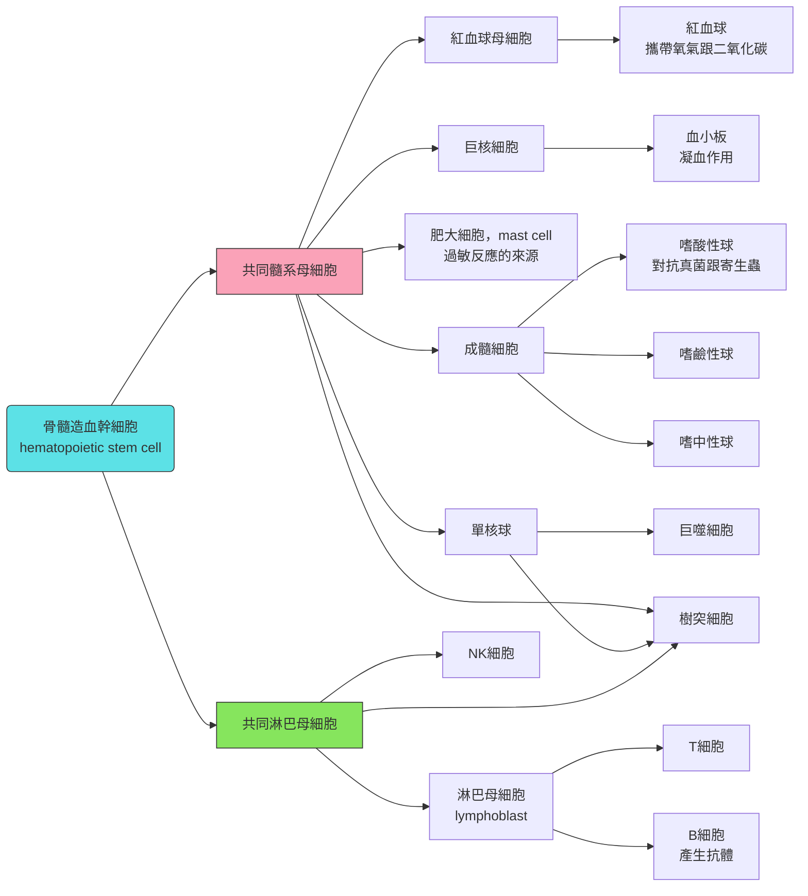

# Microbial Pathogenesis
## The Vertebrate Host
### 病原菌的四大循環
> 咱們以霍亂弧菌為例 🦠

- **Meet**: 遇到寄主，例如*V. cholerae* 透過水進去人體
- **Entry**: 要能夠通過胃酸 
- **Establish**: 住在腸道裡面
- **Cause damages**: 透過小分子訊號，使腸道收縮，跑到環境裡面去
- 無限循環

#### encounter
- 有些微生物在宿主身上不會致病，例如腸道微生物 (**microbiota**)
- 他們會跟宿主**co-exist**
- 也被稱為隱形器官 (**hidden organ**): 所有微生物身上的基因訊息總和比整個人類基因組還要高 😲

#### 腸道微生物的小分類
##### normal
- 可以分解營養，讓宿主更好吸收
- colonization resistance: 有益菌先搶先贏
- 例如*L. bifidobacterium*、大腸桿菌等等

> [!Note]
> 但是有時也會變成病原菌，例如... 長太多、免疫力下降、跑到怪怪的地方 (例如血液) 🤣

##### opportunistic
- 通常沒有什麼傷害，但也沒什麼好處
- 但是，一樣，如果你亂吃抗生素、免疫力降低，屏障被破壞，然後就會生病
- 例如*S. aureus*

##### pathogenic
- 恭喜，它們通常不在我們的身體裡 🙂
- 要是有的話，你也差不多快死了，雖然有些人的免疫力可以平衡這種傷害，導致症狀不明顯

#### incubation perio
- 這種病原菌就是，你剛開始會有和這種pathogen的攻防戰 (急性期)，然後你們有一天似乎暫時達成和平 (潛伏期)
- 結果其實這個病原菌就藏在身體裡面，然後等到時間一到，就再次發病，例如HIV

> [!Note]
> AIDS發病 = CD4 T cell < 200 /$\mu l$

#### entry
- 進到身體的方式包含: 
   - **inhalation (空氣傳染)**，例如炭癯桿菌
   - **ingestion** (通常為糞口傳染)，例如霍亂弧菌和E. coli
   - **昆蟲或是動物**，例如瘧疾、萊姆病
   - **性行為傳染** (STD)
   - **傷口感染** (手術消毒不良)
   - **器官移植**，例如輸血造成感染

#### establish
- 假如說你的病原體不多，結果剛進去身體，就被胃酸殺掉
- 因此，有三個東西會影響會不會導致疾病
   - **inoculum size** (跑進去的微生物量，也就是dose)
   - 微生物本身對於生物的**致病力**
   - 你身體弱不弱 (物理跟生物**免疫**)

#### MOI
- **multiplicity of infection**，也就是感染複數
- 通常意義就是: **到底一個細胞身上要多少病原菌才會感染**

$$MOI = \frac{\text{細菌濃度}\times \text{接種體積}}{\text{細胞數量}}$$

> [!Tip]
> - Q: 某次感染試驗，每一皿細胞數為 $2.5\times 10^5$ 個，而細菌原液濃度為 $5\times 10^7\ CFU/ml$ ，請問我要把多少原液用於培養基? 🧐
> - A: 一個培養皿要有 $20 \mu l$ 細菌原液 😗

#### damage
- 這種所謂的damage，可能只是皮膚受損 (例如痤瘡)，或是比較嚴重的東西 (例如肺炎)
- 所謂的tissue trauma，可以是凋亡，或是壞死
- 當然，這樣比起來，所謂的 "微生物把細胞打爆" 的說法，比較像是necrosis或是pyrotosis

> [!Note]
> - Q: 為什麼要問糞便的狀態? 
> - A: 這會第一時間確認你是不是有組織壞死或是pyroptosis

#### apoptosis
- 程序性細胞死亡，**PCD**
- 來自古希臘文的 "掉落、衰落"
- 會發出訊號，叫細胞死，而且不要弄太多亂事 (例如避免引起免疫反應)
- 要是細胞不會聽話死掉，恭喜，你是癌症天選之子，手指間還會黏在一起 (webbed fingers)
- 那太多apoptosis呢? 恭喜，要是細胞長不回來，例如neuron，那AD跟PD就是一種

> [!Note]
> 死掉太少會增加癌症風險，死掉太多可能和神經退化相關 😗

- 通常會有兩個死法: 

##### intrinstic
- 這通常和粒線體有關，例如氧化壓力、DNA破壞 (hello p53)、缺氧等等
- 這種內部調節由兩種蛋白互相調節: 
   - Bcl-2/Bcl-X: 抗凋亡蛋白
   - Bax/Bak: 促凋亡蛋白，促進粒線體穿孔
- 如果促進cytochrome c從粒線體跑出去，會促進apoptosome的形成
- 凋亡小體會活化caspase-9，進而活化caspase-3, 7，導致DNA斷裂，最終凋亡

##### extrinsic
- 來自外部的死亡信號
- 相關的受體接收ligands，招募adaptor protein，以及形成 DISC (死亡誘導訊號複合體)
- DISC活化caspase-8,10，進而活化Caspase-3,7，導致DNA斷裂

#### 細胞感染的防衛機制
- 在細胞受到感染時，受體Fas的表達會增加，並且分布在細胞膜上面
- 當遇到了NK cell時，該細胞會和他結合，啟動FADD和DISC (外部誘因)
- 這就是細胞免疫的機制之一

#### 不同角度對於apoptosis的看法

|角度|促進apoptosis目的|抑制apoptosis目的|example|
|---|---|---|---|
|**Host**|**切斷複製基地**: 讓被感染細胞死亡，減少病原擴散 (尤其是病毒)|**保護器官功能**: 避免太多細胞死亡造成組織崩壞，或是爭取時間讓免疫清除病原|• 病毒感染細胞，常被誘導進入凋亡，以阻斷病毒複製 • 但是若凋亡過度，如肺/腸上皮大量死亡，反而造成嚴重病理|
|**Pathogen**|**破壞屏障/免疫**: 誘導上皮或免疫細胞凋亡，削弱防禦、促進擴散或釋放|**延長宿主細胞壽命**: 讓細胞活久一點，方便在細胞內複製、躲避免疫、建立持續感染|• 許多病毒，如herpesviruses、poxviruses、adenoviruses，常有 "抗凋亡" 策略，它們需要潛伏於宿主身上 • 同時，一些感染會導致免疫細胞凋亡，例如 HIV 感染時，CD4 T cell 死亡|

### phage
- 基因組可以是ssDNA (M13、 $\phi$ X174)，或是dsDNA (T4)，或是ssRNA (MS2)，或是dsRNA ( $\phi$ 6) 
- 頭部通常是正二十面體 (當然，M13沒有頭，他就是一根麵條)
- 他可以控制細菌，複製嗜菌體自身的genome，然後產生新的phage
- 尾部以及腳，通常包含尾管 (tail tube)，以及尾鞘 (tail sheath)

> [!Note]
> \lambda phage是有尾鞘的，只是... 就一根腳 🙂

#### bacteriophage lambda
- 有溶解循環跟溶原循環兩種
- lysogenic:雙股DNA變成前嗜菌體 (prophage)，**整合進宿主的基因體**
- 一旦受到某些刺激，例如環境不佳，前嗜菌體就會脫離，進行溶解循環。
- 其DNA有**黏性末端，注入細胞後會環化**，這個時候，不同的轉錄途徑會影響是否會產生溶原循環

|特徵	|Lytic cycle|Lysogenic cycle|
|---|---|----|
|病毒DNA|	獨立複製|整合進宿主DNA|
|宿主細胞|最後死亡|暫時存活|
|病毒產量|快速大量|幾乎沒有立即產生|
|時間尺度|短期|長期潛伏|
|是否形成 prophage|	✘|✔|
|是否可轉成另一型態|-|可被誘導成 lytic|

### 免疫速讀
#### 先天性免疫
##### Mechanical
- 例如皮膚

##### Chemical
- 皮膚因為正常細菌保護產生的油脂
- 胃酸
- 組織內的抗菌肽
- 細胞內的水解酶
- 小腸內的膽鹽
- 補體系統

##### cellular
- 嗜中性球、巨噬細胞

#### 後天性免疫
- **Humoral**: antibidy (IG, made by B cells)
- **Cell mediate** (T cell)

> [!Tip]
> 後天性免疫在宿主遭到第二次感染時，會以更快，力度更大的方式清除病原體，這可以從antibody在血液中的濃度飆升幅度來看 🐱

#### Antigen
- 抗原會特異性的結合於抗體，尤其是在後天性免疫
- 當然，一個抗原會有不同抗原結合域 (epitope)，所以可能可以被多個抗體辨識

#### innate
##### skin
- 表面有高鹽度
- 有抗菌肽，就像一把細針把細菌穿孔
- 脂肪酸可以抑制病原體的生長 (也是會透過接觸病原體的表面達到這一點)

##### mucous membranes
- 例如呼吸道、消化道、泌尿生殖道的黏膜
- 裡面其實有抗體，也有溶菌酶、乳鐵蛋白等等

#### 所謂的發炎是什麼
- 發炎反應通常有幾個特徵: 
  - 血流量在感染處增加: 局部發熱和發紅
  - 組織液累積: 腫脹
  - 釋放化學物質，影響神經信號: 痛覺
- 包含的成員...
  - mast cell: 釋放組織胺，導致血管擴張、血管通透性增加
  - phagocyte: 從血管內皮縫隙鑽出來
  - 補體系統: 增加細菌穿孔、促進phagocyte的吞噬作用 
- phagocyte的促進活化，可以受到以下影響: 
##### opsonin
- 在希臘文就是... 好吃的意思
- 例如C3b (補體蛋白的一種)
- 這些小多肽會接觸於病原體表面
- 當這些小多肽接觸到巨噬細胞的表面受體時，就會促使吞噬作用

> [!Tip]
> - Opsonin: 它很好吃 😗
> - Phagocyte: 好喔 🙂
> - Pathogen: 💀

| 種類  | opsonin-dependent | opsonin-independent      |
| --- | ----------------- | ------------------------ |
| 特徵  | 細胞透過辨識補體來打擊  | 細胞透過辨識病原體本身有的一些物質來打擊 |
| 舉例  | 經典路徑跟凝集素路徑   | 病原體相關分子模式 (PAMP or MAMP) |

##### antibody
- 例如IgG
- 由後天性免疫的plasma cell釋放
- 也是接觸於病原體表面的抗原，巨噬細胞也有IgG receptor，可以辨識抗原

#### white blood cell簡介
- 白血球在骨髓裡面或是胸腺裡面待著，其餘的會跟著血液循環流動，平均濃度為4500-10000  $cells/mm^3$

### phagocytosis
#### 吞噬作用步驟
- 偽足 (pseudopod) 包圍病原體
- 產生吞噬小體 (phagosome)
- 吞噬小體會和溶體結合，溶體pH值低 (例如裡面就有鹽酸)，也有水解酶
- 融合後，就會降解病原體
- 能夠做吞噬作用的免疫細胞，就是嗜中性球和巨噬細胞

> [!Note]
> phagosome + lysosome = phagolysosome 🐱

#### neutrophils
- 壽命非常短
- 身上數量最多的白血球
- 主要以吞噬作用處理病原體
- 通常是感染時，最先到場的responders，也會遷移
- 動作非常快 (賽車變形蟲? 🤣)

> [!Tip]
> ##### 遷移主要靠什麼?
> - **chemotaxin** = 細胞因子中一群專門進行趨化作用的蛋白們
> - **diapedesis** = 白細胞從內皮細胞的間隙中鑽出血管

#### 細胞因子風暴
> [!Warning]
> 為什麼不要讓嗜中性球全衝過來? 因為這會**導致 "血球滲漏" 的現象 !** 💀

- 舉例，你的肺泡是不可能會有血球的，但是在肺炎發生時，這些嗜中性球會衝入肺泡間隙，造成嗜中性球浸潤 **(neutrophilic infiltration)**

- 除此之外，有一個東西叫做pus (也就是膿)，這東西的型態會有所不同
  - 如果長期的pus都沒有痊癒基向，很有可能會造成長期的發炎，進而造成損傷
  - 肺浸潤有時就是pus積聚在肺葉的現象
  - 如果pus積聚在腦部，就是腦水腫，例如以下這張腦膜炎照片

#### macrophage
- 來自於單核球的分化，但是單核球的包吞作用比較沒有那麼強
- 單核球會跑到各個不同的器官內，並且在該處形成專一性的，更分化的巨噬細胞，因此不同器官的巨噬細胞都有點不一樣
- 除了吞噬病原體，他也會做清道夫，或著是進行組織的修剪
- 當辨識DAMP並吞噬後，他可能會釋放cytokine，募集更多的白血球
- 這些白血球可以是募集先天，或是後天的免疫

> [!Note]
> **macrophage** 和 **dendritic cell** 都可以**成為先天和後天免疫之間的橋梁**

### 先天性免疫的辨識
#### 為甚麼免疫細胞能辨識出病原體
> [!Note]
> 先天性免疫根本就沒有辨識敵我的才能 (眼瞎)，他們是怎麼做到的? 🧐

- **PAMP: 病原體相關分子模式**，是病原體身上一些，可能可以被先天免疫辨認的東西
- 這些分子往往都是病原體打死都不可或缺的物質
- 病原菌表面會有一些特定的東西，例如**脂多醣 (LPS)、peptidoglycan**
- 而辨識這些PAMP的受體，統稱為**PRRs**

#### PRR 種類
> [!Important]
> **PRR不是只有在細胞表面而已 !** 😏

- 常見的有這幾種...
  - **Toll-like receptor:** 分布在細胞膜上
  - **NOD-like receptor:** 分布在細胞質中
- TLR其實是在果蠅發育裡面發現了，叫做**Toll protein**，這基因在果蠅身上被knock out後，複眼上會產生菌絲[^1]

- 然後他們發現人也有，老鼠也有，植物也有，都是跟疾病的抵抗力有關
- **TLR會在辨認PAMP後二聚化**，進而促進下方的細胞級聯反應

[^1]: https://www.sciencedirect.com/science/article/pii/S0092867400801725

#### PAMP vs antigen
- 細菌基本上一定有細胞壁 (通常啦)，會被PRRs辨認

> [!Warning] 
> 有一個概念要理解，就是這些先天免疫的PRRs，其實是**演化下來後，生來就辨識某種PAMPs**。它們是天生可以看到LPS等物質

- 抗體不一樣的地方就是，即使PRR沒有辨識某個新的物質，只要抗體可以接上去，先天免疫細胞就看的到
- 所以過程通常都是這樣: 先天免疫會先啟動，眼半瞎摸摸看看有沒有PAMPs，一直到後天性免疫丟出抗體，讓辨識力增強

##### 舉個例子: 鼠傷寒桿菌
- 這兩個鼠傷寒桿菌的毒性不一樣，但是PAMP一模一樣，對於先天性免疫來說，它們一模一樣，根本不知道誰好誰壞
- 免疫系統唯一可以辨識這兩個桿菌的差別，就是病原體才有Vi antigen，所以這只有在antibody接上去的時候才有效[^2]

[^2]: https://journals.plos.org/plospathogens/article?id=10.1371/journal.ppat.1002933

#### TLR

> [!Tip]
> - 以下是不同TLR辨認的PAMPs，盡量都記起來喔呵呵 🙂
>   - TLR-3: dsDNA
>   - TLR-4: 脂多醣
>   - TLR-5: 鞭毛蛋白 (flagellin)
>   - TLR-7、TLR-8: ssRNA

- 這些受體活化後，會促進 NF- $\kappa$ B pathway
- NF- $\kappa$ B是一個轉錄因子，基本上調控的基因大多是有關於促炎的細胞因子
- 通常調控這些基因，會活化巨噬細胞 (吞噬作用增強)、釋放更多cytokine、維持細胞的存活

#### NLR
- 也是原本先發現NOD protein，然後才發現
- 這東西會偵測細胞內的PAMP，也會trigger NF-kappa B
- 同時，他也會產生inflammasome (發炎小體)，發炎小體可以做兩件事情: 

#### inflammasome
- 在產生發炎小體之前，會先啟動caspase-1
- 之後caspase-1會活化IL-1 beta、IL-18，最後**導致pyrotosis**

<iframe src="https://Jacklyn301.github.io/molecular_model/8EJ4_Cryo-EM%20structure%20of%20the%20active%20NLRP3%20inflammasome%20disk.html" width="100%" height="500px"></iframe>

> [!Tip]
> - 這跟apoptosis不一樣，因為pyrotosis的訊號會**吵到其他免疫系統**
> - IL-1 beta、IL-18會立刻叫嗜中性球過來

- 發炎小體起始是由 "尚未活化的" IL-1 beta、IL-18驅動，這會導致NLR受體聚集起來，變成一朵花，然後招募一堆caspase-1跟自己結合
- 這朵花就是發炎小體，這個發炎小體會變成碎紙機，把未活化的cytokine全部剪切成活化態
- 除了活化各種細胞因子，也會活化**gasdermin D，這東西可以在細胞膜上面打洞**

<iframe src="https://Jacklyn301.github.io/molecular_model/6VFE_Gasdermin%20D%20pore.html" width="100%" height="500px"></iframe>

- 最後導致大量細胞因子、DAMP的洩漏，這就是pyrotosis (通俗來說，就是 **"大聲疾呼的火燒般的死亡 🤣"**)

> [!Important]
> 細胞焦亡的前提，就是**TLR跟NLR都活化** (因為TLR才會促進未活化的細胞因子轉錄出來) !

#### 最後補充: 嗜中性球跟巨噬細胞的比較

|cell|macrophage|neutrophil|
|---|---|---|
|位置|會長期駐紮在器官上面|只會在發炎的組織上被招喚出來|
|發炎時|稍微增加活性|數量迅速增加，產生急性發炎反應|
|生活史|壽命很長，吞噬病原體後依然存活 😎|壽命很短，吞了病原體就死 🙂|

### 後天性免疫
#### 簡介
##### Humoral immunity
- 主角就是漿細胞跟抗體，漿細胞並不會接觸真正感染的細胞，只會拿水管一頓灌

##### cell-mediated immunity
- 主角是胞毒性T細胞，Tc一定需要跟感染細胞有接觸，才有可能導致對方的細胞凋亡

#### B cell
- B cell 上面有受體，可以辨識特定 "抗原"
- 如果受體接觸到抗原，B cell會開始不斷複製 (clonal expansion)，並且分化為漿細胞
- 漿細胞的細胞質會大幅增加，ER的portion增加，為了大量製造所謂的B cell受體，也就是抗體

#### T cell
- 也有自己特定的受體，負責辨識 "抗原呈現細胞"
- 病原體無論是被巨噬細胞或是嗜中性球吞噬，或是一般細胞被感染，病原體的部分片段都會被呈現在細胞膜上
- 呈現抗原的 "手臂"，就是MHC (主要組織相容複合體)
- 受感染的細胞上面如果有相應的抗原，配對的T cell就會target這個受感染的細胞，將其凋亡
- 通常來說...
   - **MHC I:** 呈現的抗原由Tc cell (CD8+) 辨識
   - **MHC II:** 呈現的抗原由Th cell (CD4+) 辨識

##### 疫苗
- 疫苗會注入抗原等等東西，這些抗原會被細胞吸收，然後透過MHC呈現給T cell
- 其中，同時可以活化Th跟Tc的抗原呈現細胞就是樹突細胞
- Th辨識成功後會迅速活化，並且相繼活化B cell 和 Tc 
- Tc活化後就會去找其他的感染細胞，使他們凋亡

#### 淋巴球成熟方式
- T cell會先被篩選一遍，凡是可以自我遍是的都會被消除
- 在篩選完之後，這些傢伙還叫做**naive T cell**，也就是還沒真正碰到抗原的T cell
- 一旦遇到外來抗原，他們就會被活化，然後一樣大量複製自己，他們都辨識同一種抗原

> [!Tip]
> - **B cell 在骨髓中成熟**
> - **T cell 會遷移到胸腺再成熟**

#### 抗體的功能
- **neutralization (中和作用):** 讓一些原本很毒的東西，降低甚至抑制他跟別的東西接觸，避免他傷害其他細胞
- **opsonization (調理作用):** 抗體接觸了病原體，會促進他們聚集，也會讓巨噬細胞更好辨識他們

#### dendritic cell
- 原本的樹突細胞可以在血液或是組織中，而且尚有吞噬能力，但是一旦遭遇病原體成熟後，他會遷移至淋巴結
- 成熟的樹突細胞主要就是呈現抗原給T cell，成為APCs，自己也幾乎不吞噬了
- 呈現抗原的方式也是用MHC，只是他**兩種MHC (I、II) 都有**

